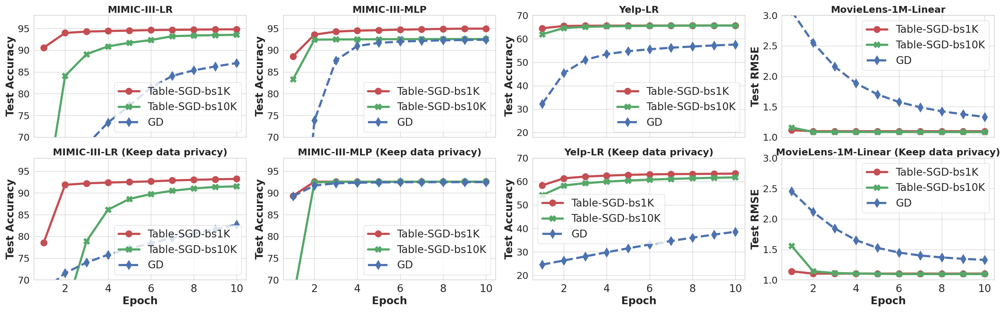

# Table-SGD

## Run

```sh
python run/sgd.py <path to dataset> --project=<wandb project name> --dataset=<dataset name>
```

To enable differential privacy (DP), add the *--use_DP=True* flag and specify the *max_per_sample_clip_norm* and *target_epsilon values*. For example:

```sh
python run/sgd.py <path to dataset> --project=<wandb project name> --dataset=<dataset name> --use_DP=True --max_per_sample_clip_norm=1 --target_epsilon=1
```

## Results

We conducted tests on these three datasets using our Table-SGD and compared the results with baseline [GD](#Reference).

1. MIMIC-III
2. Yelp
3. MovieLens-1M

We obtained the original dataset from the official site and performed some preprocessing to convert all data into a numerical format that can be easily processed by the model.



## Reference

1. Arun Kumar et al: Learning Generalized Linear Models Over Normalized Data. SIGMOD 2015
2. Maximilian Schleich et al: Learning Linear Regression Models over Factorized Joins. SIGMOD 2016
3. Lingjiao Chen, et al: Towards Linear Algebra over Normalized Data. VLDB 2017
4. Maximilian Schleich et al: A Layered Aggregate Engine for Analytics Workloads. SIGMOD 2019
